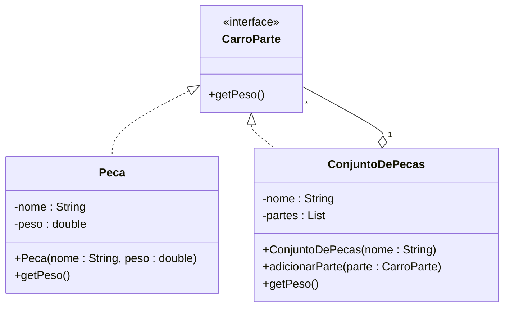

```mermaid
classDiagram
    direction TB

    class CarroParte {
        <<interface>>
        +getPeso()
    }

    class Peca {
        -nome : String
        -peso : double
        +Peca(nome : String, peso : double)
        +getPeso()
    }

    class ConjuntoDePecas {
        -nome : String
        -partes : List<CarroParte>
        +ConjuntoDePecas(nome : String)
        +adicionarParte(parte : CarroParte)
        +getPeso()
    }

    CarroParte <|.. Peca
    CarroParte <|.. ConjuntoDePecas
    ConjuntoDePecas "1" o-- "*" CarroParte
```
